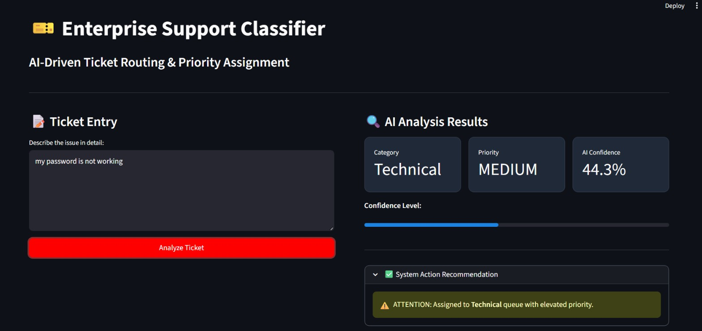

# Support Ticket Classification System 

## Project Overview
This project is an AI-powered Support Ticket Classification System developed during my internship at **Future Intern**. The system automates the process of categorizing incoming customer support queries and assigning them a priority level (High, Medium, or Low) using Natural Language Processing (NLP) and Machine Learning.

---

## Interactive Web App
I have integrated a **Streamlit** dashboard to provide an enterprise-grade user interface where users can input ticket descriptions and receive real-time AI analysis, including:
* **Automatic Category Routing:** (Technical, Billing, Account, Hardware)
* **Priority Tagging:** Instant identification of urgent issues.
* **AI Confidence Scoring:** Displays the model's certainty for every classification.

---

##  Key Features
* **NLP Preprocessing:** Utilizes `spaCy` for text tokenization and lemmatization.
* **Machine Learning Pipeline:** Uses `TF-IDF Vectorization` and `Multinomial Naive Bayes` for high-speed, accurate text classification.
* **Confidence Metrics:** Visualizes the probability of the predicted category using progress bars and metrics.
* **Custom Styling:** Enhanced UI with CSS-injected dark mode components.

---

##  Tech Stack
* **Language:** Python
* **Web Framework:** Streamlit
* **Machine Learning:** Scikit-learn
* **NLP:** spaCy
* **Data Handling:** Pandas

---

## Visual Preview
Below is a screenshot of the live Enterprise Support Classifier in action:



---

## How to Run the Project
1. Clone the repository:
   ```bash
   git clone [https://github.com/Dileep2006/FUTURE_ML_02.git](https://github.com/Dileep2006/FUTURE_ML_02.git)
